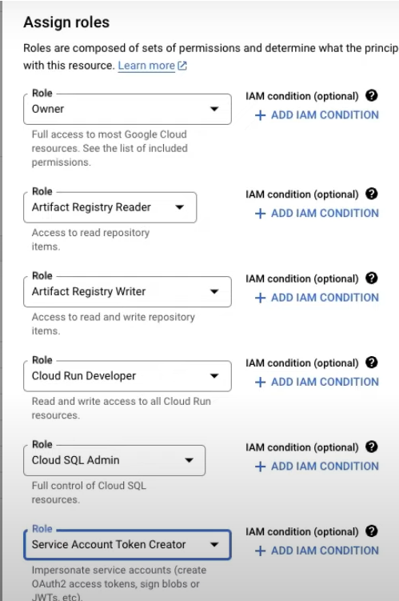

# DEZ-2024
---
## Week 2 - Workflow and Orchestration

### DE Zoomcamp 2.2.1 - What is Orchestration?

- 2.2.1 - 📯 Intro to Orchestration
  - 2.2.1a - What is Orchestration?
    - Steps = tasks
    - Workflows = DAGs(Directed acyclic graphs)
    - Orchestration is an undercurrents

- 2.2.2 - 🧙‍♂️ Intro to Mage
  - 2.2.2a - What is Mage?
    - Flow state - Feedback loops - Cognitive Load
    
  - 2.2.2b - Configuring Mage
    - Clone the repo
    - Use docker-compose to build the magic+postgree dockers
    - Run the docker-compose
    - Now we have the interface launched
  - 2.2.2c - A Simple Pipeline
    - Example of 3 blocks
    
- 2.2.3 - 🐘 ETL: API to Postgres
  - 2.2.3a - Configuring Postgres
    - Done : 
    - Define in .env (added to github ignore)
    
```
    PROJECT_NAME=magic-zoomcamp
    POSTGRES_DBNAME=postgres
    POSTGRES_SCHEMA=magic
    POSTGRES_USER=postgres
    POSTGRES_PASSWORD=postgres
    POSTGRES_HOST=postgres
    POSTGRES_PORT=5432
```    
Then we can use the env variable in our code :
```
    dev:
        # PostgresSQL
      POSTGRES_CONNECT_TIMEOUT: 10
      POSTGRES_DBNAME: "{{ env_var('POSTGRES_DBNAME') }}"
      POSTGRES_SCHEMA: "{{ env_var('POSTGRES_SCHEMA') }}"
      POSTGRES_USER: "{{ env_var('POSTGRES_USER') }}"
      POSTGRES_PASSWORD: "{{ env_var('POSTGRES_PASSWORD') }}"
      POSTGRES_HOST: "{{ env_var('POSTGRES_HOST') }}"
      POSTGRES_PORT: "{{ env_var('POSTGRES_PORT') }}"
```  
- 2.2.3b - Writing an ETL Pipeline
    - Done
- 2.2.4 - 🤓 ETL: API to GCS
  - 2.2.4a - Configuring GCP
    - Create the account to create buckets
    - In docker-compose of mage add credential for gcp (json file)
```
    # Google
      GOOGLE_SERVICE_ACC_KEY_FILEPATH: "/home/src/de-zoomcamp-2024.json"
```    
  - 2.2.4b - Writing an ETL Pipeline
    - Now create a pipeline that connect to GCP 
    - Upload data in bucket after partionining in parquet by dates :
    
```
    import pyarrow as pa 
    import pyarrow.parquet as pq 
    
    def export_data(data, *args, **kwargs):
        """
        Exports data to some source.
        """
        data['tpep_pickup_date'] = data['tpep_pickup_datetime'].dt.date 
        
        table = pa.Table.from_pandas(data)
        
        gcs = pa.fs.GcsFileSystem()
        pq.write_to_dataset(
            table,
            root_path=root_path,
            partition_cols=['tpep_pickup_date'],
            filesystem=gcs
        )

```    
- 2.2.5 - 🔍 ETL: GCS to BigQuery
    - Create new pipline to load taxi data, transform it and then load it to BigQuery :
    
    
```
    @transformer
    def transform(data, *args, **kwargs):
        """
        Standarised data colum names
        """
        # Specify your transformation logic here
        data.columns = (data.columns
                        .str.replace(' ','_')
                        .str.lower()
        )
        return data

```    
- 2.2.6 - 👨‍💻 Parameterized Execution
  - 2.2.6a - Parameterized Execution
    - Idea to use the passed args in the functions, and also it is possible to define personal var that will be passed same way
```
    
    "
        now = kwargs.get('execution_date')
        now_fpath = now.strftime("%Y/%m/%d")
        
        config_path = path.join(get_repo_path(), 'io_config.yaml')
        config_profile = 'default'
        bucket_name = 'mage-zoomcamp_art'
        object_key = f'{now_fpath}/daily-trips.parquet'
        GoogleCloudStorage.with_config(ConfigFileLoader(config_path, config_profile)).export(
            df,
            bucket_name,
            object_key,
        )

```    
Mage variables : https://docs.mage.ai/development/variables/overview
    - Mage Runtime Variables
    
  - 2.2.6b - Backfills
    - Used to create virtual running of the pipeline if using the data for example as it will simulate the execution time as you want
- 2.2.7 - 🤖 Deployment (Optional)
  - 2.2.7a - Deployment Prerequisites
    - Objective using terraform to : Create an app / persistant cloud in gcp / app in gcp 
  - 2.2.7b - Google Cloud Permissions
    - Config permission in GCP
    
  - 2.2.7c - Deploying to Google Cloud - Part 1
    - Connect to GCP : gcloud auth activate-service-account dtc-user@de-zoomcamp-2024.iam.gserviceaccount.com --key-file=/home/amine/DEZ-2024/02-workflow-orchestration/mage-zoomcamp/de-zoomcamp-2024.json
    - Get templates for terraforms : git clone https://github.com/mage-ai/mage-ai-terraform-templates.git
  
  - 2.2.7d - Deploying to Google Cloud - Part 2
    - Need activate Cloud SQL Admin API
    - https://docs.mage.ai/production/deploying-to-cloud/architecture
    
    
- 2.2.8 - 🧱 Advanced Blocks (Optional)
- 2.2.9 - 🗒️ Homework
- 2.2.10 - 👣 Next Steps

---


