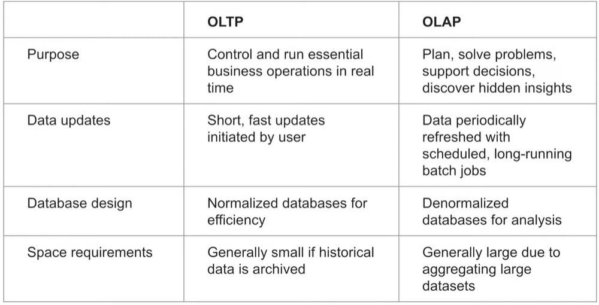
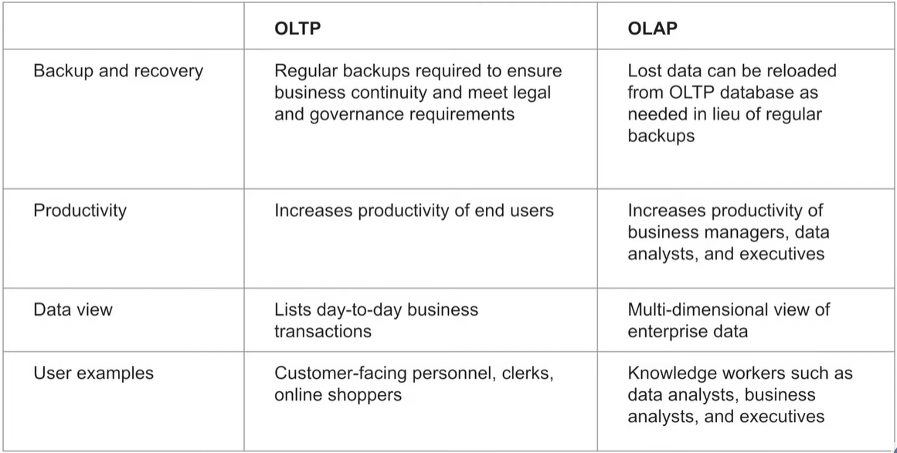
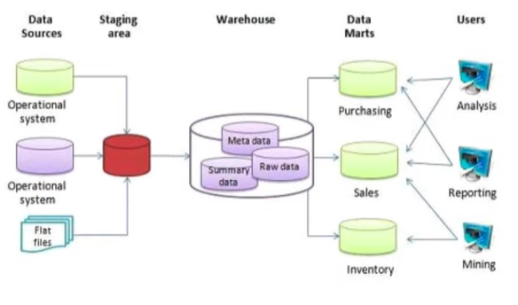
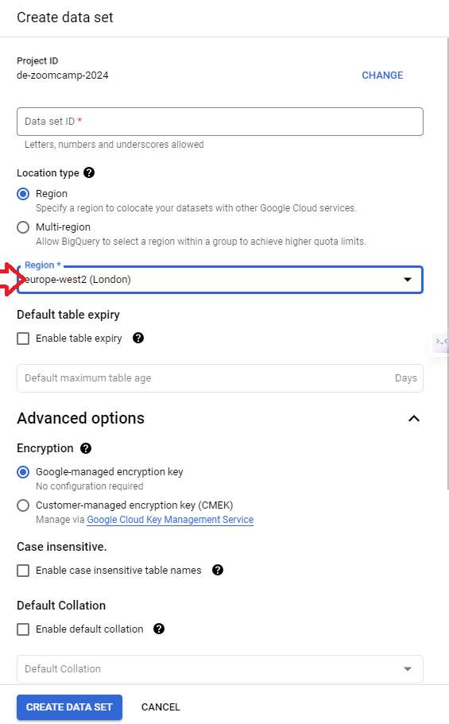
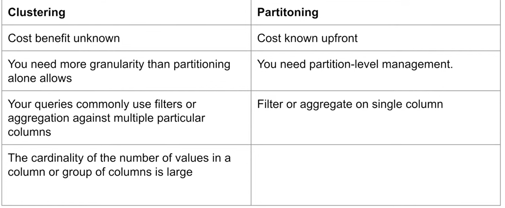
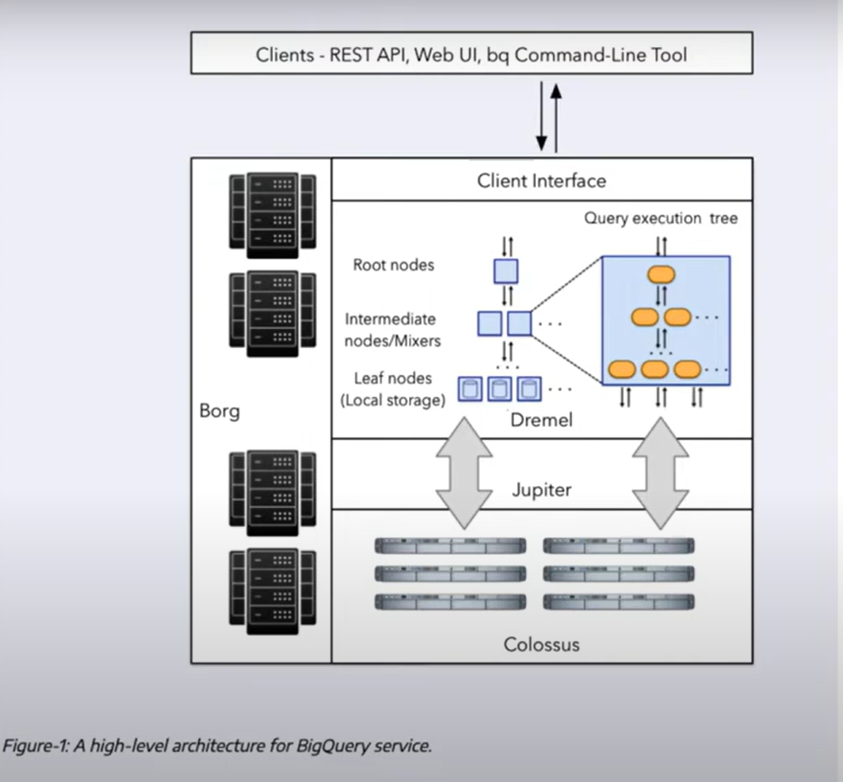
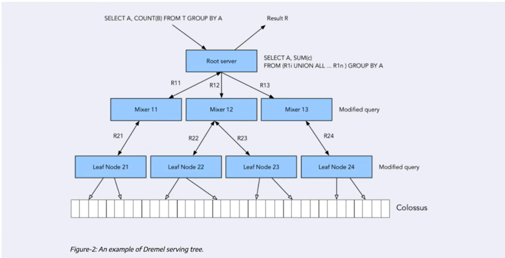
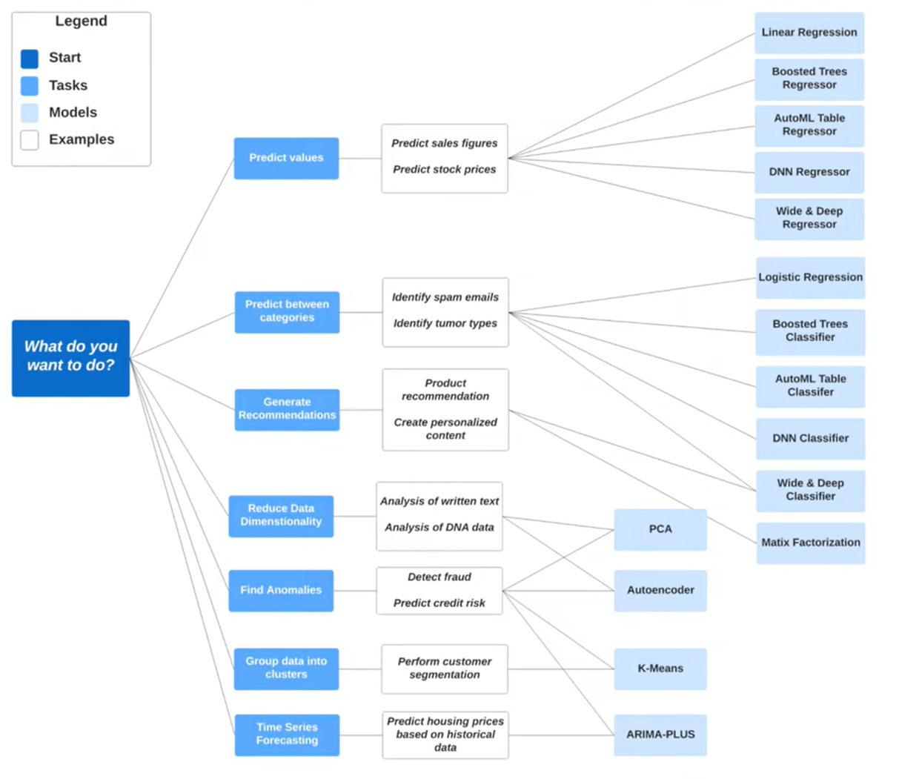

# DEZ-2024
## Week 3 - Data Warehouse

### 3.1.1 - Data Warehouse and BigQuery
- OLTP Vs OLAP:
    - OLTP : Online Transaction Processing
    - OLAP : Online Analytical Processing
    
    
- Data warehouse is OLAP Solution and consists of :
    - Raw data
    - Meta Data
    - Summary Data
    
- BigQuery : 
    - Data warehouse solution
    - serveless 
    - Built-in features : ML, BI, Geospatial data
    - low cost as seperate from the compute engine

**Comment 1** : for our demo/test here, disable the cache from the BiqQuery GCP interface (under More/Query Setting/Use cached results)

**Comment 2** : For the upload of the `yellow_tripdata` database, need to make sure the table structure type are defined manually. This was done through an update from last year file :  [web_to_gcs_2.py](Week-03-data-warehouse/03-data-warehouse/extras/yellow_tripdata_2019-02.csv).

**Comment 3** : Make sure that your data from your bucket and yoru BigQuery are both in the same region. If your database was created in default region, this could be US, and your Bucket is in europe, you won't be able to make the partionned tables. This should be done when creating the dataset :

---
### 3.1.2 - Partioning and Clustering
- BigQuery partition:
    - Think of using expiring partitions strategy (as the number is limited)
- BigQuery Clustering:
    - Order of the column is important
    - Clustering improves Filter queries and aggregate queries
    - Table with data size < 1GB don't need clustering or partitioning
    - can specify up to four clustering columns
    - clustering columns must be top-level, non repeated columns
- Partitioning Vs Clustering :

- Automatic reclustering :
    - BigQuery performs automatic re-clustering in the background with no costs

---
### 3.2.1 - BigQuery Best Practices
- Objectives :
    - Cost reductions :
        - Avoid `SELECT *`
        - Price your queries before running them
        - Use clustered or partitioned tables
        - uses streaming inserts with caution (as it could increase cost quickly)
        - use query in small data size before doing it on all
    - Better Query Performance:
        - Filter on partioned columns 
        - Denormalizing data
        - reduce before using `JOIN`
        -  Order to be used last
        - Best practice : Place the table with the largest number of rows first, followed by table with the fewest rows and then place the remaining tables by decreasing
---
### 3.2.2 - Internals of Big Query

- Internal architecture of Big Query :
    - Colossus is where the data are storage (cheap cost)
    - Data storage seperate from computing 
    - COst is mainly when doing query 
    - BigQuery is using column-oriented

- Below example of how  a query is managed by Big Query :

- Links to some additional reading :
    - https://cloud.google.com/bigquery/doc...
    - https://research.google/pubs/pub36632/
    - https://panoply.io/data-warehouse-gui...
    - https://www.goldsborough.me/distribut...

---
### 3.3.1 - BigQuery Machine Learning

NB: Advanced example with previous knowledge about ML.
**Objective** : build module, export it and run it by Docker.

- BigQuery support to build ML model in the Warehouse

- Pricing :
    - Free : 
        - 10 GB/month of data storage
        - 1 TB per month of queries processed
        - ML Create model step : First 10 GB per month is free
    - Paid :
        - 250$ per TB for some ML model (LR, K-mean, time series)
        - 5$ per TB + Vertex AI Training cost for AutoML / DNN / Boosted Tree models

- Recommendations for model to be used based on BigQUery documentation :

- See link to to different documnentation to see how :
    - Create model with defaut setting 
    > (model_type='linear_reg',\
    > input_label_cols=['tip_amount'],\
    > DATA_SPLIT_METHOD='AUTO_SPLIT')
    - Check feature :
    > ML.FEATURE_INFO(MODEL `<DATA>.tip_model`)
    - Evaluate the model :
    > ML.EVALUATE(MODEL `<DATA>.tip_model`...)
    - Predict the model :
    > ML.PREDICT(MODEL `<DATA>.tip_model`,...)
    - Predict and explain the model :
    > ML.EXPLAIN_PREDICT(MODEL `<DATA>.tip_model`,...)
    - Hyper parameter tuning :
    > num_trials=..., max_parallel_trials=..., l1_reg=hparam_range(0, 20),l2_reg=hparam_candidates([0, 0.1, 1, 10]) ...
 
---
### 3.3.2 - BigQuery Machine Learning Deployment

- Model deployment
[Tutorial](https://cloud.google.com/bigquery-ml/docs/export-model-tutorial)
### Steps

- gcloud auth login
- bq --project_id taxi-rides-ny extract -m nytaxi.tip_model gs://taxi_ml_model/tip_model
- mkdir /tmp/model
- gsutil cp -r gs://taxi_ml_model/tip_model /tmp/model
- mkdir -p serving_dir/tip_model/1
- cp -r /tmp/model/tip_model/* serving_dir/tip_model/1
- docker pull tensorflow/serving
- docker run -p 8501:8501 --mount type=bind,source=`pwd`/serving_dir/tip_model,target=
  /models/tip_model -e MODEL_NAME=tip_model -t tensorflow/serving &
- curl -d '{"instances": [{"passenger_count":1, "trip_distance":12.2, "PULocationID":"193", "DOLocationID":"264", "payment_type":"2","fare_amount":20.4,"tolls_amount":0.0}]}' -X POST http://localhost:8501/v1/models/tip_model:predict
- http://localhost:8501/v1/models/tip_model

Those steps create a copy of our model into an API that we will run on Docker, then it will be accessible by sending a POST request to the API with a JSON parameters such as :
>> {"instances": [{"passenger_count":1, "trip_distance":12.2, "PULocationID":"193", "DOLocationID":"264", "payment_type":"2","fare_amount":20.4,"tolls_amount":0.0}]}

Launch again docker :
docker run -p 8501:8501 --mount type=bind,source=`pwd`/serving_dir/tip_model,target=/models/tip_model -e MODEL_NAME=tip_model -t tensorflow/serving &

---
### Homework

- created a python script to upload the dataset to gcp : [hw_web_to_gcs.py](Week-03-data-warehouse/03-data-warehouse/extras/hw_web_to_gcs.py)
- SQL query used to retrieve the answers : [homework.sql](Week-03-data-warehouse/homework.sql)
---

**External sources :**

- [Slides](https://docs.google.com/presentation/d1a3ZoBAXFk8-EhUsd7rAZd-5p_HpltkzSeujjRGB2TAI/edit?usp=sharing)
- `big_query.sql` (see repo)
- `big_query_ml.sql` (see repo)

**BigQuery for ML**

- [BigQuery ML Tutorials](https://cloud.google.com/bigquery-ml/docs/tutorials)
- [BigQuery ML Reference Parameter](https://cloud.google.com/bigquery-ml/docs/analytics-reference-patterns)
- [Hyper Parameter tuning](https://cloud.google.com/bigquery-ml/docs/reference/standard-sql/bigqueryml-syntax-create-glm)
- [Feature preprocessing](https://cloud.google.com/bigquery-ml/docs/reference/standard-sql/bigqueryml-syntax-preprocess-overview)
