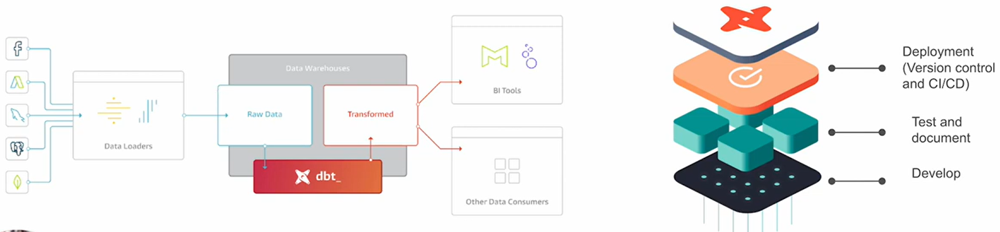
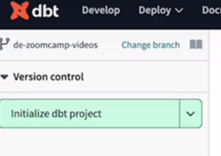
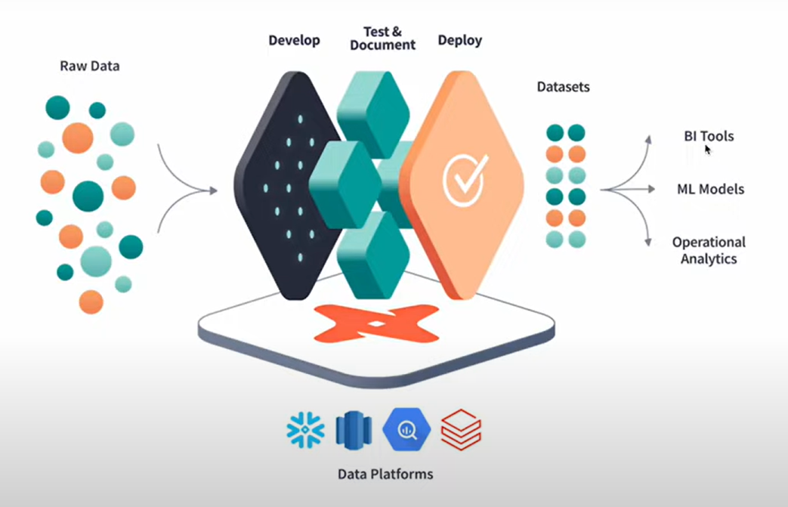
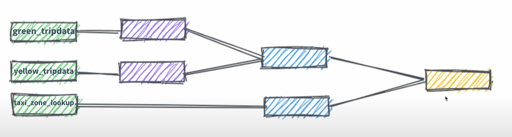

# DEZ-2024
## Week 4 - Data Analytics

### Prerequisites
By this stage of the course you should have already: 

- A running warehouse (BigQuery or postgres) 
- A set of running pipelines ingesting the project dataset (week 3 completed)
- The following datasets ingested from the course [Datasets list](https://github.com/DataTalksClub/nyc-tlc-data/): 
  * Yellow taxi data - Years 2019 and 2020
  * Green taxi data - Years 2019 and 2020 
  * fhv data - Year 2019. 

### 4.1.1 - Analytics Engineering Basics
- What is analytics engineering :
    - MPP : massively parallel processing (MPP) database
    - different tools like mage, sql-first ...
    - Roles in data team :
        - Data Engineer : prepare and maintain the infrastructure 
        - data analyst : uses data to answer question and solve problems
        - analytics engineer : gap between the software engineering skills and the business knowledge from data analyst/scientist
    - Tooling : 
        > Data Loading \
        > Data Storing: _Cloud data warehouses like Snowflake, BQ, Redshift_ \
        > Data modelling: _tools like dbt or Dataform_ \
        > data presentation: _BI tools like goolge data studio, Looker, Mode or Tableau_
    - ETL Vs ELT (see Week 2)
    - Kimball's Dimentional Modeling :
        - Objective L deliver data understandable to the business users
        - Approache : prioritise user understandability and query perf over non redundant data 
    - Element of Dimentional Modeling :
        - Facts table : measurements, metrics or facts ("verbs")
        - dimensions tables : corresponds to a business entity ("nouns")
    - Architecture of dimensional modeling (comparing with restaurant):
        - Stage area : raw data, not meant to exposed to everyone (stockage area)
        - processing area (kitchen) : from raw to data models
        - presentation area (dining hall) : final presentation, exposed to business stakeholders

### 4.1.2 - What is dbt :
- transformation workflow that allows anyone that knows SQL to deploy analytics code in the data warehouse

- how to use dbt :
    - dbt Core :
        - Builds and runs dbt project (.sql and .yml files)
        - SQL compuilation logic, macros and database adapters
        - omc;ide a CLI interface to run dbt command locally
    - dbt Cloud :
        - SaaS application to develop and manage dbt projcets
        - Web-based IDE


### 4.2.1 - Start Your dbt Project BigQuery and dbt Cloud
- Create a new dbt project
- initialize dbt project :
    - 
- Create a new branch to be able to start editing the project
- update `dbt_project.yml`
    - update name of the project under `name`:
```
models:
  taxi_rides_ny:
    # Applies to all files under models/example/
    # example:
    #  +materialized: table
```
- run `dbt build` and commit

### 4.3.1 - Build the First dbt Models
- Anatomy of a dbt model: written code vs compiled Sources
- Materialisations: table, view, incremental, ephemeral
- Seeds, sources and ref
- Jinja and Macros
- Packages
- Variables

- Overall of the process :


- 4 types of materializations in dbt Cloud :
    - Ephemeral : not materialised in the BQ, temporary and exit only for the duration of single dbt run
    - view : virtual tables created by dbt that can be queried like regular tables
    - table : physical representations of data that are created and sotred in the database
    - incremental : feature of dbt allow for efficient update to existing tables
- Example in our taxi trip data :


- we will use for example :
    - Sources (from the BQ) : `from {{ source('staging','yellow_trip_data_2021_01') }}`
    - Seeds (used for data not huge and usually doesn't change frequrently ) `from {{ ref('taxi_zone_loolup')}}`
    - ref : from dbt model `from {{ ref ('stg_green_tripdata')}}`

- Create under models/staging/schema.yml :
```
version: 2

sources:
  - name: staging
    database:
      de-zoomcamp-2024
      # For postgres:
      #database: production
    schema:
      nytaxi

      # loaded_at_field: record_loaded_at
    tables:
      - name: green_tripdata_non_partitoned
      - name:
          yellow_tripdata_non_partitoned
```

- After this build the whole project by : `dbt build`
- we can add packages by creating at the dbt home folder a file `package.yml` containing for example :
```
packages:
  - package: dbt-labs/dbt_utils
    version: 1.1.1
```

- exemple to use : add this function from the package in our green data sql : `{{ dbt_utils.generate_surrogate_key(['vendorid', 'lpep_pickup_datetime']) }} as tripid,`

- Variables : we can define variable : example : `{{ var('...') }}`
```


  limit 100


```
### 4.3.2 - Testing and Documenting the Project

- Tests
- Documentation

- examples :
  - Using gencodes : 
    - https://hub.getdbt.com/dbt-labs/codegen/latest/
``` 

{{ codegen.generate_model_yaml(
    model_names = models_to_generate
) }}
```

  - Tests :
  ```
              tests:
                - unique:
                    severity: warn
                - not_null:
                    severity: warn
  ``` 
  ```
              tests:
              - relationships:
                  to: ref('taxi_zone_lookup')
                  field: locationid
                  severity: warn
  ```
  ```
              tests: 
              - accepted_values:
                  values: "{{ var('payment_type_values') }}"
                  severity: warn
                  quote: false
  ```

### 4.4.1 - Deployment Using dbt Cloud (Alternative A)
- Deployment: development environment vs production
  - go to environment and create a new env for prod
  - create a new job and use the schedule
- dbt cloud: scheduler, sources and hosted documentation

### 4.5.1 - Visualising the data with Google Data Studio (Alternative A)
- if online we could use Google Data Studio
- if locally we can install Metabase using docker and run it locally


### Homework:

- uploading the data fhv 2019 in our bucket
- creating the tables :
```
-- Creating external table referring to gcs path
CREATE OR REPLACE EXTERNAL TABLE `de-zoomcamp-2024.nytaxi.external_fhv_tripdata`
OPTIONS (
  format = 'PARQUET',
  uris = ['gs://mage-zoomcamp_art/fhv/fhv_tripdata_2019-*.parquet']
);
-- Check yello trip data
SELECT COUNT(*) FROM de-zoomcamp-2024.nytaxi.external_fhv_tripdata;

-- Create a non partitioned table from external table
CREATE OR REPLACE TABLE de-zoomcamp-2024.nytaxi.fhv_tripdata_non_partitoned AS
SELECT * FROM `de-zoomcamp-2024.nytaxi.external_fhv_tripdata`;
```

- for the FHV table, check the table structure here : https://www.nyc.gov/assets/tlc/downloads/pdf/data_dictionary_trip_records_fhv.pdf
- 